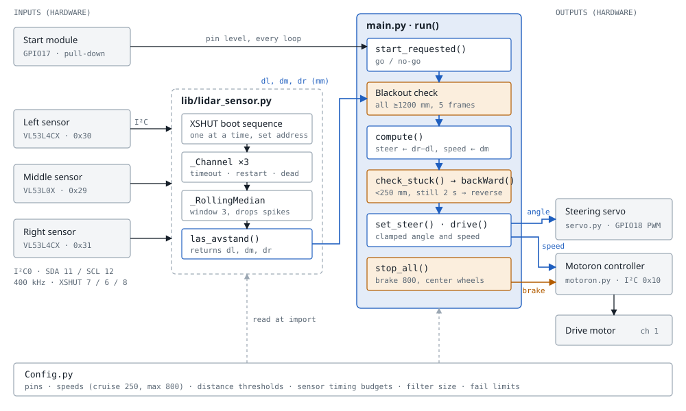
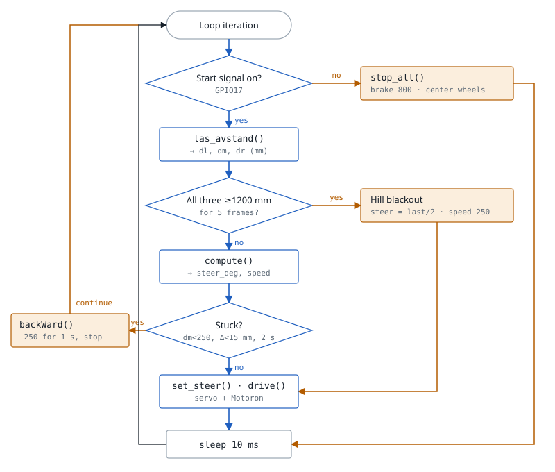

# Snok 1.2 Architecture

How the autonomous car's code is wired: three distance sensors feed a control law that drives the steering servo and the Motoron motor controller. Blue is the normal driving path; orange marks the safety paths (stop, blackout, reverse).

To view the full page, open [architecture.html](architecture.html) in a browser.

## System block diagram

All three sensors and the Motoron share one I²C bus, created in `lib/lidar_sensor.py` and reused by `main.py`. A sensor that misses 3 reads in a row gets its continuous mode restarted; after 10 it raises, and `run()` catches the error and calls `stop_all()`. The Motoron's own command timeout also stops the motor if the loop stalls.

## Main loop

One pass of `run()` in `main.py`. Any exception, including a dead sensor or Ctrl-C, leaves the loop through `stop_all()`. The blackout branch exists because the car pitches nose-up on a hill and all three beams can look over the walls.

| Setting (`Config.py`) | Value | Effect |
|---|---|---|
| `DIST_CLEAR` | 1000 mm | middle sensor at or above this → full cruise |
| `DIST_SLOW` | 750 mm | below this → slow down, steering ×3.5 |
| `DIST_STOP` | 300 mm | at or below this → crawl speed |
| `CRUISE_SPEED` | 250 | normal forward speed (Motoron units, max 800) |
| `STEER_LEFT/CENTER/RIGHT_DEG` | 60° / 90° / 120° | steering servo angles |
| `STEER_SPAN_MM` | 500 mm | `dr − dl` difference that gives full steering lock |
